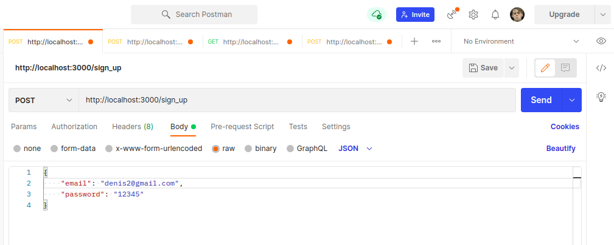
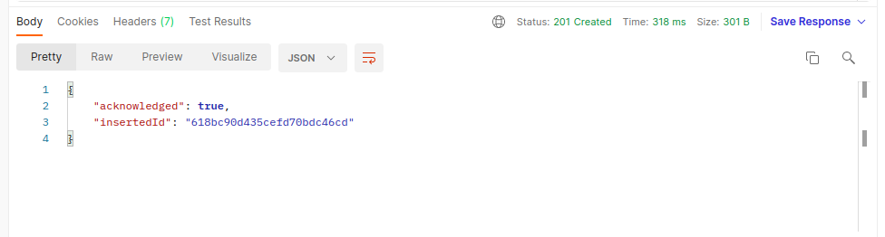
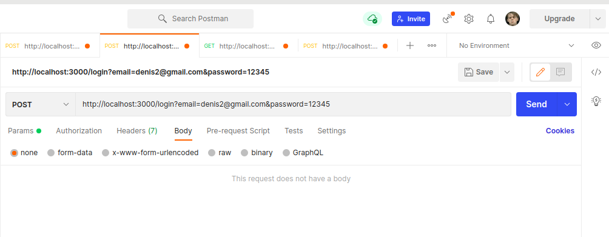
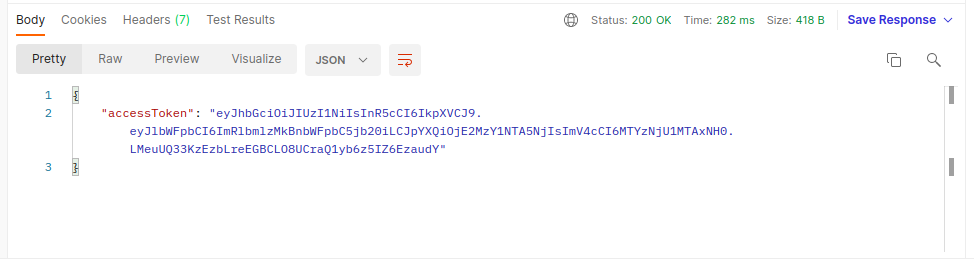
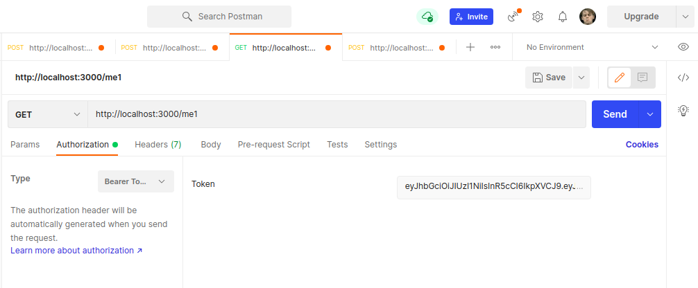
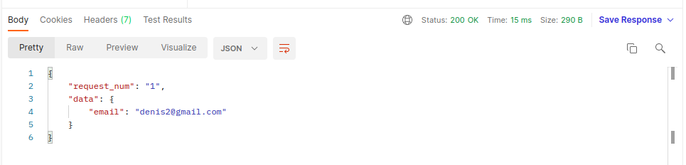
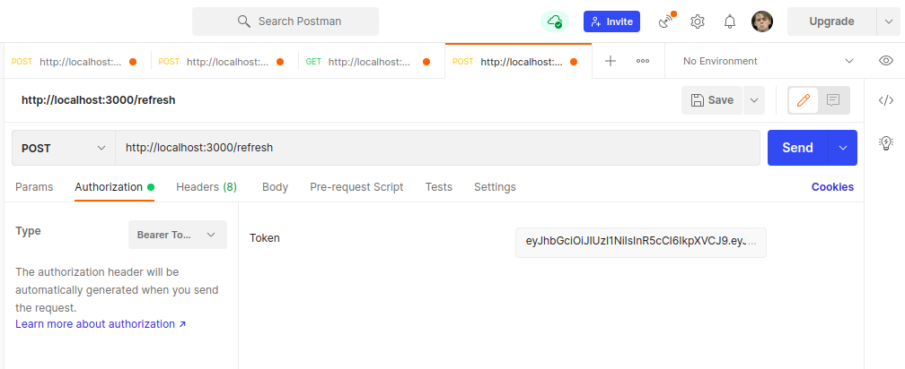
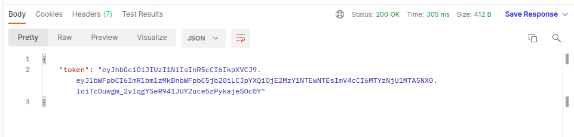

## Request to /sign_up example:

## Response to /sign_up example:

## Request to /login example:

## Response to /login example:

## Request to /me1 (0-9) example:

## Response to /me1 (0-9) example:

## Request to /refresh example:

## Response to /refresh example:

